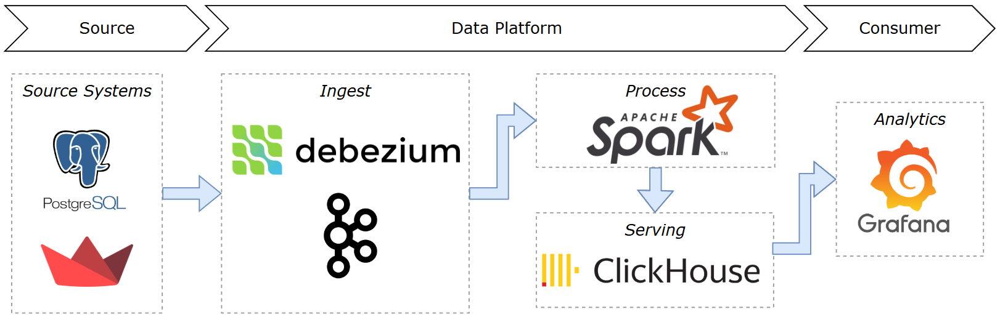
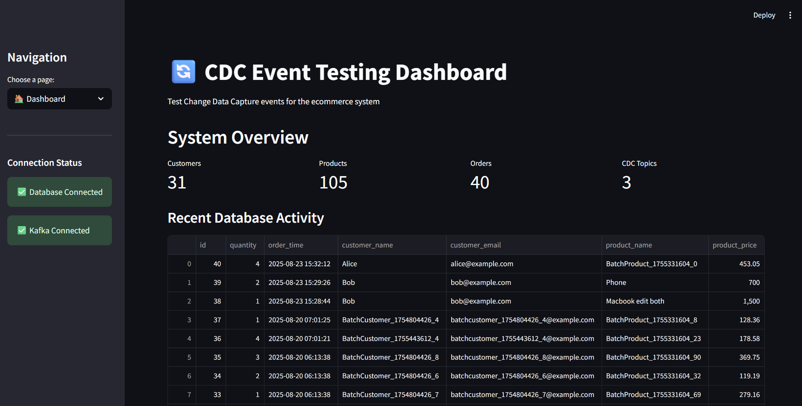
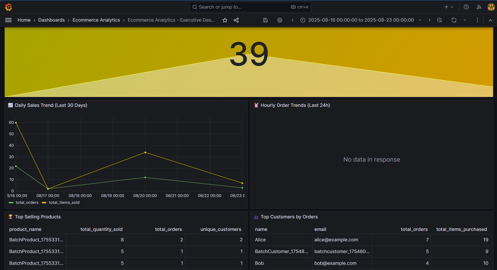
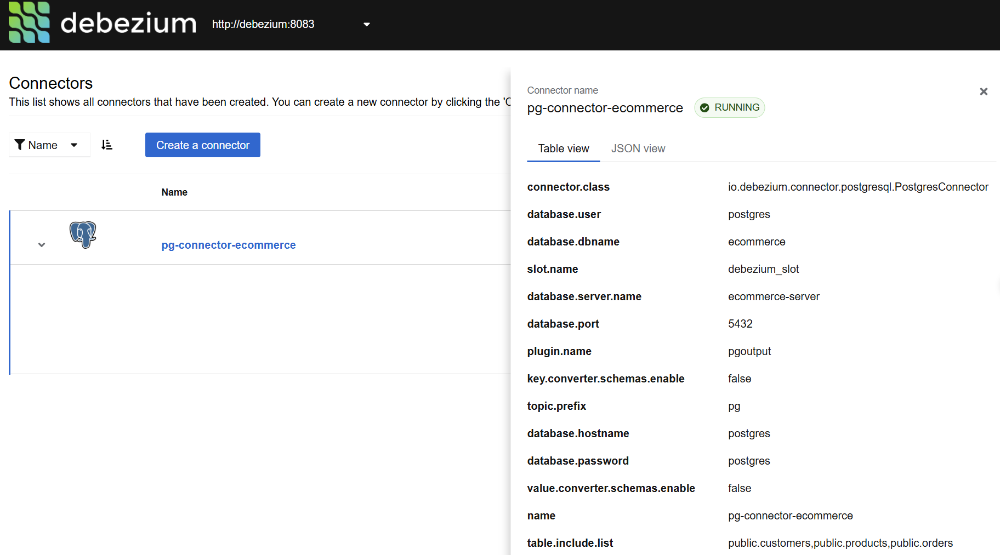
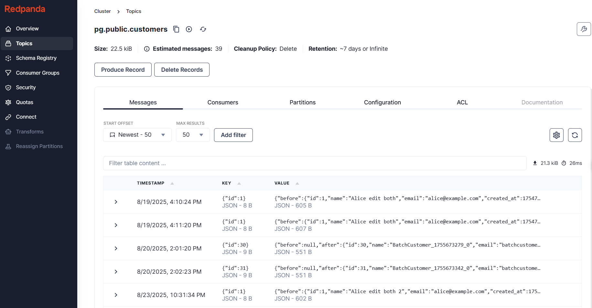

# CDC Ecommerce Project

This project is a demo platform for Change Data Capture (CDC), featuring:

- Streamlit UI for editing/viewing data
- Kafka, Debezium, Postgres, Spark, ClickHouse, Grafana dashboards

## Technical stack

| **Layer**                    | **Technology**           | **Purpose**                                           |
| ---------------------------------- | ------------------------------ | ----------------------------------------------------------- |
| **Data Source (OLTP)**       | PostgreSQL                     | Source transactional database for CDC demo.                 |
| **Change Data Capture**      | Debezium                       | Captures row-level changes and streams to Kafka.            |
| **Event Streaming**          | Kafka / Redpanda               | Message broker for CDC events.                              |
| **Stream Processing**        | PySpark (Structured Streaming) | Transforms, enriches, and deduplicates CDC data.            |
| **Analytics Storage (OLAP)** | ClickHouse                     | Stores processed data for fast analytical queries.          |
| **Visualization**            | Grafana                        | Dashboards for monitoring CDC pipelines.                    |
| **Demo UI**                  | Streamlit                      | Interactive interface to test CDC and generate sample data. |
| **Infrastructure Setup**     | Docker Compose, Makefile       | Manages local deployment and service automation.            |



---

## Quick Start (Docker Only)

### Requirements

- Docker & Docker Compose installed
  - [Install Docker](https://docs.docker.com/get-docker/)
  - [Install Docker Compose](https://docs.docker.com/compose/install/)
- GNU Make installed
  - [Install Make](https://www.gnu.org/software/make/)

#### Installation on Ubuntu

Install required tools with the following commands:

```bash
# Install Docker
sudo apt update
sudo apt install -y docker.io
sudo systemctl enable docker
sudo systemctl start docker

# Install Docker Compose
sudo apt install -y docker-compose

# Install GNU Make
sudo apt install -y make
```

### Run

Clone the repository, copy environment file, and run the entire CDC Ecommerce stack:

```bash
git clone https://github.com/plat102/pj-ecommerce-cdc.git
cd pj-ecommerce-cdc

# Create the .env file
cp .env.example infrastructure/docker/.env

 # Start all services (DB, Kafka, Debezium, UI, Spark, Analytics...)
make up
```

---

## Available Dashboards & UIs

After running `make up`, you can access the following interfaces:

- **Streamlit UI (CDC Testing UI):**

  - [http://localhost:8501](http://localhost:8501)
  - Edit and view data, test CDC flows interactively.

  
- **Grafana Dashboard:**

  - [http://localhost:3000](http://localhost:3000)
  - Visualize analytics and metrics (default user: `admin`, password: `admin123`).
  - Query and explore analytics data in ClickHouse.

  
- **Debezium UI:**

  - [http://localhost:8085](http://localhost:8085)
  - Manage CDC connectors and monitor their status.

  
- **Kafka Console (Redpanda Console):**

  - [http://localhost:8080](http://localhost:8080)
  - Inspect Kafka topics, messages, and consumer groups.

  

---

## Implementation Highlights

### Notable Engineering Decisions

**🏗️ Layered Spark code structure -** Separated concerns into `apps/`, `jobs/`, `io/`, `transformations/`, `schemas/`, and `config/` for maintainability and code reuse across jobs. See: [`data-platform/streaming/spark/src/`](data-platform/streaming/spark/src/)

* **Base Job Framework** - Built [`BaseCDCJob`](data-platform/streaming/spark/src/jobs/base_cdc_job.py) abstract class handling Spark session, I/O setup, streaming/debug modes, and checkpoints-jobs only implement transform logic.

**🔄 CDC Deduplication Pattern** - Implemented ClickHouse `ReplacingMergeTree` with `_version` (from Debezium `ts_ms`) and `_deleted` flag for automatic deduplication. See: [`create_tables.sql`](infrastructure/docker/clickhouse/create_tables.sql)

**⚙️ Developer Automation** - Single-command orchestration via Makefile (`make up`, `make cdc-run`, `make cdc-debug`). See: [`Makefile`](Makefile)

### Key Challenges & Learnings

**🔧 Debezium Decimal Encoding**

*Problem:* Debezium encodes PostgreSQL `DECIMAL`/`NUMERIC` types as base64 strings with scale metadata, causing type mismatch errors in Spark.

*Solution:* Built custom UDF ([`decode_decimal_udf`](data-platform/streaming/spark/src/utils/udfs.py)) to parse base64-encoded bytes and reconstruct decimal values with proper precision.

*Learning:* Verify CDC serialization formats when integrating tools-schema evolution requires explicit type conversions.

**🚀 Local Environment Complexity**

*Problem:* Running 8+ services (Postgres, Kafka, Debezium, Spark, ClickHouse, Grafana, Streamlit) simultaneously on developer machines.

*Solution:* Modularized Docker Compose files by service group with health checks, dependency ordering, and Makefile targets for incremental startup.

*Learning:* Good developer experience reduces onboarding friction and encourages experimentation.

---

## Future Enhancements

**⚡ Versioned Checkpoint Management** - Implement versioned checkpoint directories (e.g., `/checkpoints/orders_cdc/v1`, `/v2`) to handle schema changes and job updates without losing streaming state, enabling zero-downtime deployments.

**📊 Materialized Views for Query Performance** - Implement ClickHouse materialized views with pre-aggregated CDC data to eliminate the need for `FINAL` modifier in dashboard queries, improving Grafana refresh speeds.

**🔐 Schema Registry Integration** - Add Confluent Schema Registry to manage Avro/JSON schemas centrally, enabling better schema evolution tracking and validation.

**🧪 Automated Testing Suite** - Build integration tests for CDC pipelines using pytest and Docker Compose to validate end-to-end data flow from Postgres → Kafka → Spark → ClickHouse.

**📈 Metrics & Alerting** - Implement Prometheus exporters for Kafka lag, Debezium connector health, and Spark job metrics with alerting rules in Grafana.

**🔄 Multi-Environment Support** - Extend infrastructure to support dev/staging/prod environments with environment-specific configurations and separate ClickHouse clusters.

---
