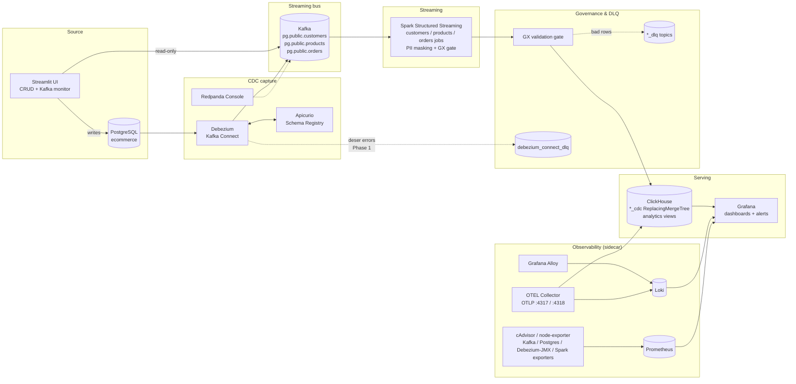
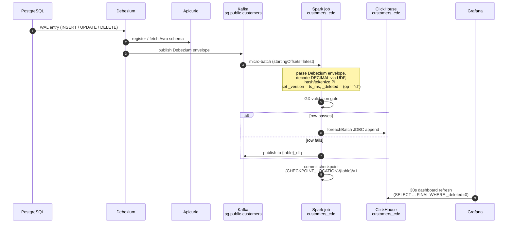
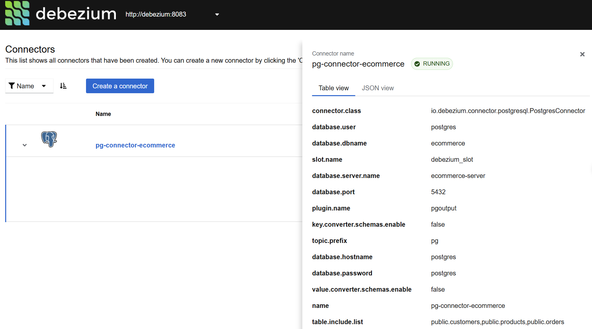
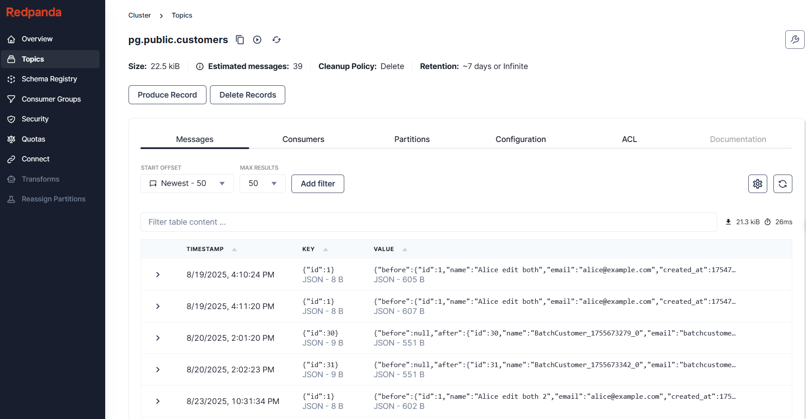
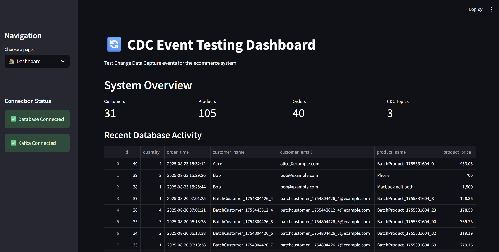
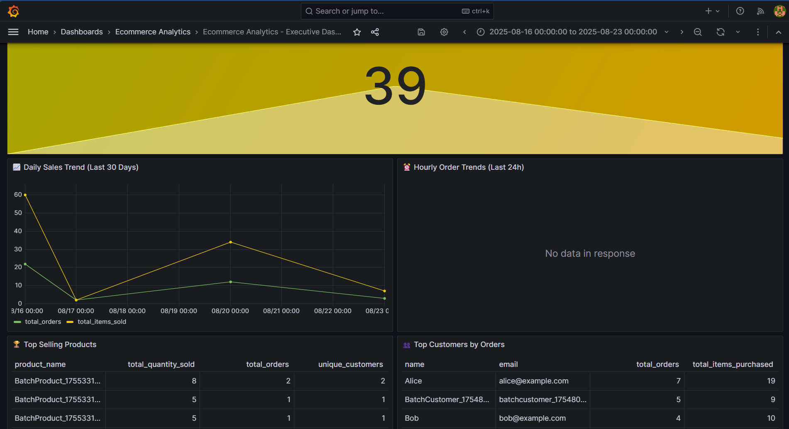

# Architecture

End-to-end Change Data Capture demo: **PostgreSQL → Debezium → Kafka → PySpark Structured Streaming → ClickHouse → Grafana**, with a Streamlit UI for driving CDC events, a Loki+Prometheus observability stack, and a governance layer (Apicurio schema registry, PII masking, GX validation gate, DLQ, RBAC, retention). Everything runs locally via Docker Compose orchestrated by the `Makefile` at the repo root.

Prerequisite: create `infrastructure/docker/.env` from `.env.example` before running any `make` target — the Makefile has no fallback.

## High-level architecture

## Components

| Component | Host port(s) | Purpose |
|---|---|---|
| PostgreSQL | 5432 | Source OLTP database (`ecommerce`) |
| Debezium (Kafka Connect) | 8083 (REST), 5556 (JMX) | Captures WAL → Kafka; Apicurio Avro converter |
| Debezium UI | 8085 | Web UI for connector state |
| Apicurio Registry | 8081 | Avro schema storage (`http://schema-registry:8080/apis/registry/v2` in-network) |
| Kafka (kafka1) + Zookeeper | 9092 | Streaming bus, topics `pg.public.{customers,products,orders}` |
| Redpanda Console | 8080 | Read-only Kafka browser |
| Spark (ed-pyspark-jupyter) | 4040 (UI), 8888 (Jupyter) | PySpark Structured Streaming jobs |
| ClickHouse | 8123 (HTTP), 9000 (native) | OLAP store (`ecommerce_analytics`) with `ReplacingMergeTree` CDC tables |
| Streamlit UI | 8501 | CRUD driver + Kafka monitor |
| Grafana | 3000 | Dashboards + Unified Alerting; three provisioned datasources (ClickHouse, Loki, Prometheus) |
| Loki | 3100 | Log store (7-day retention) |
| Prometheus | 9090 | Metrics store (7d / 1GB cap) |
| Grafana Alloy | 12345 | Tails container stdout → Loki |
| cAdvisor | 8082 | Per-container CPU/mem/net/disk metrics |
| node-exporter | 9100 | Host-level metrics |
| Kafka / Postgres / JMX exporters | 9308, 9187, 5556 | Pipeline-source metrics |
| OTEL Collector | 4317 (gRPC), 4318 (HTTP), 8889 (self-metrics) | Unified ingress → Loki + ClickHouse `otel_logs` / `otel_traces` |

Docker Compose is split into seven files under `infrastructure/docker/` (`db`, `kafka`, `debezium`, `ui`, `spark`, `analytics`, `observability`) — `make up` composes them all under the `ecommerce-cdc` project name. Common Makefile targets: `make up` / `make down` / `make stop` / `make start` / `make status` / `make logs`; per-service groups have their own `up-*` / `down-*` / `logs-*` / `sh-*` targets. Run `make help` (or read the `Makefile`) for the full list.

## Record flow (single row)

## Cross-cutting concerns

- **Analytics** — dedup model, provisioned dashboards, ClickHouse views. See [`analytics.md`](analytics.md).
- **Observability** — Loki+Alloy logs, Prometheus + exporters, five infra alerts, optional OTEL Collector. See [`observability.md`](observability.md).
- **Governance & DLQ** — Apicurio schema contracts, PII masking, GX gate, DLQ topology (GX DLQ applied; Kafka Connect DLQ Phase 1 applied; Spark sink DLQ proposed), RBAC, retention/TTL. See [`governance.md`](governance.md).

## Repo layout

See [`project-structure.md`](project-structure.md).

## Local service URLs (after `make up`)

Core:
- Streamlit UI — http://localhost:8501
- Grafana — http://localhost:3000 (`admin` / `<GRAFANA_ADMIN_PASSWORD>` from `infrastructure/docker/.env`)
- Debezium UI — http://localhost:8085 · Connect REST — http://localhost:8083
- Redpanda Console — http://localhost:8080
- Apicurio Registry — http://localhost:8081
- ClickHouse — http://localhost:8123 (HTTP) · 9000 (native)
- Spark UI — http://localhost:4040 · Jupyter — http://localhost:8888

Observability:
- Prometheus — http://localhost:9090
- Loki — http://localhost:3100 (query API only; use Grafana Explore)
- cAdvisor — http://localhost:8082 · node-exporter — http://localhost:9100/metrics
- Alloy — http://localhost:12345
- OTEL Collector — self-metrics http://localhost:8889/metrics · OTLP gRPC :4317 · OTLP HTTP :4318

## Screenshots

- 
- 
- 
- 
