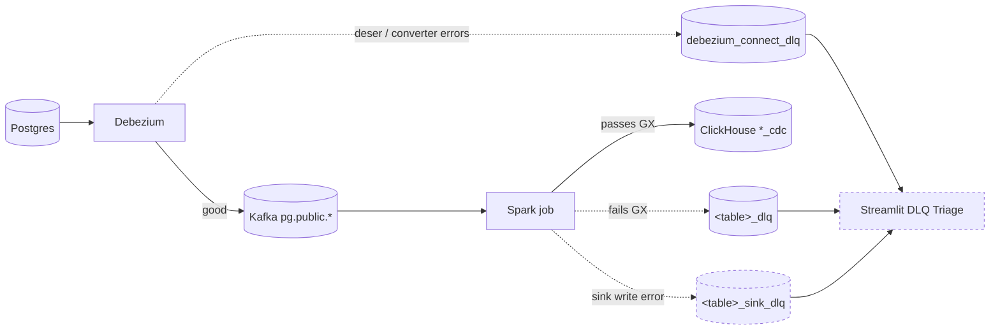

# Data governance

Everything the CDC pipeline does to keep data trustworthy — i.e. prevent schema violations, exposing raw PII, writing invalid rows, and losing audit trails: **schema contracts**, **PII masking**, **quality gate**, **DLQ topology**, **RBAC**, **retention / TTL**, and **catalog + lineage**.

Prerequisite reading: [`architecture.md`](architecture.md) for the pipeline these controls wrap.

Capability boundary: `data-governance` decides *what makes a row invalid* (GX suites, schema mismatches, PII contracts). `error-handling` (proposed change `add-error-handling-dlq`) decides *what happens after* — the DLQ topology below already spans both.

## Schema Registry (Apicurio)

- Debezium key/value converter: `io.apicurio.registry.utils.converter.AvroConverter`.
- Endpoint (in-network): `http://schema-registry:8080/apis/registry/v2`.
- Debezium container runs with `ENABLE_APICURIO_CONVERTERS=true`.
- Host access: http://localhost:8081.
- Connector config: `data-platform/cdc/connectors/register-pg.json` (connector name `pg-connector-ecommerce`, captures `public.customers`, `public.products`, `public.orders`).

## PII masking in Spark

Applied inside the transformers before write to ClickHouse (raw values never land in the analytics store):

| Column | UDF | Output shape |
|---|---|---|
| `customers.email` | `hash_pii_udf` | 64-char lowercase hex SHA-256 salted with `PII_SALT` |
| `customers.name` | `tokenize_name_udf` | `{first-initial-uppercase}.{6-hex}` (e.g. `A.7f3c9d`) |

UDFs live in `data-platform/streaming/spark/src/utils/udfs.py`. Salt comes from the `PII_SALT` env var (set in `infrastructure/docker/.env` — leave as a placeholder in git).

## Data quality gate

Spark's `foreachBatch` writer is wrapped with `with_gx_gate` — each micro-batch runs a Great Expectations suite before the ClickHouse append. Rows that fail expectations are routed to `{table}_dlq` on Kafka instead of dropped.

## DLQ topology

Solid arrows = happy path. Dashed arrows = quarantine. Dashed nodes = not yet implemented (see status table below).



Status legend:

| DLQ topic | Trigger | Status |
|---|---|---|
| `{table}_dlq` | GX suite fails for a row inside `foreachBatch` | **applied** (data-governance Phase 3) |
| `debezium_connect_dlq` | Kafka Connect deserialization / converter error (`errors.tolerance=all`) | **Phase 1 applied** (commit `c1a55ce`) |
| `{table}_sink_dlq` | Spark → ClickHouse JDBC write failure | **proposed** (Phase 2 of `add-error-handling-dlq`) |
| Central DLQ dashboard + `dlq_traffic_present` alert | > 0 messages on any `*_dlq` in 5 min | **proposed** (Phase 3) |
| Streamlit `DLQ Triage` page | Browse quarantined rows by `dlq_topic`, `error_class`, `key`, `payload`, `first_seen` | **proposed** (Phase 4) |

Non-goals for the error-handling change: automatic DLQ replay (manual by design), cross-topic correlation (each stage owns its own DLQ), retention beyond the 14-day topic policy set below.

## RBAC (ClickHouse)

- Role `analyst_readonly` — declared in `infrastructure/docker/clickhouse/create_tables.sql`.
- Grants: `SELECT` on `customers_cdc`, `products_cdc`, `orders_cdc`. No `INSERT` / `ALTER` / `DROP`.
- Row policy: only rows where `_deleted = 0` are visible.
- User is created at container init by `create_governance_users.sh` using `CLICKHOUSE_ANALYST_PASSWORD` (in `.env`, placeholder in git).
- Grafana's `ClickHouse-Analytics` datasource connects as `analyst_readonly` — dashboards can never see tombstones or mutate data.

## Retention & TTL

**Kafka** — applied by `data-platform/governance/retention/apply-kafka-topic-retention.sh`:

| Topic pattern | `retention.ms` |
|---|---|
| `pg.public.*` | 7 days (`604800000`) |
| `governance.access_log` | 30 days (`2592000000`) |
| `*_dlq` | 14 days |

**ClickHouse** — TTL clauses on every `*_cdc` table anchored on `toDateTime(_version / 1000)`:

| Rule | Retention |
|---|---|
| `WHERE _deleted = 1 DELETE` | 90 days (tombstones) |
| `DELETE` (unconditional) | 2 years (active rows) |

**Postgres** — `data-platform/governance/retention/postgres-archive.sql` defines an `orders_archive` table and moves rows with `order_time < now() - INTERVAL '1 year'` into it. The archive table is **excluded** from Debezium's `table.include.list` so archival never generates spurious CDC traffic.

## Checkpoint versioning

Spark checkpoints live at `{CHECKPOINT_LOCATION}/{table}/v{schema_version}` (Phase 1 hard-codes `schema_version = 1`). Prevents checkpoint corruption when a job's transform/schema shape changes but the checkpoint path stays constant — bump the version, get a fresh path.

Base class: `data-platform/streaming/spark/src/jobs/base_cdc_job.py`.

## Catalog & lineage (optional)

- **OpenMetadata** ingestion configs live under `data-platform/governance/openmetadata/ingestion/` (postgres.yaml, kafka.yaml, clickhouse.yaml). Operated via `make up-governance` / `down-governance` — not included in `make up` because of the memory footprint (MySQL + Elasticsearch).
- **OpenLineage** Spark listener is gated by `ENABLE_OPENLINEAGE=1`; when on, Spark emits lineage events for each streaming query.
- Column-level documentation lives in `COMMENT` clauses inside `infrastructure/docker/clickhouse/create_tables.sql`.

### Populate the catalog

`make up-governance` brings the OpenMetadata stack online, but the catalog at http://localhost:8585 lands empty — no database services, no messaging services, no tables. Populate it on demand:

```
make up-governance        # first-time only; also: make migrate-governance
make ingest-all           # ~90s on a warm ingestion image; runs pg → kafka → clickhouse fail-fast
make ingest-status        # prints service counts (expect 2 database, 1 messaging, 0 pipeline)
```

Individual targets: `make ingest-pg`, `make ingest-kafka`, `make ingest-clickhouse`.

**Ingestion is idempotent** — re-running any target updates existing entries in place rather than creating duplicates. Safe to schedule from CI on every schema-affecting PR.

Ingestion runs via an ephemeral `docker run --rm openmetadata/ingestion:1.5.9` container joined to `ecommerce-network`. No host `pip install`, no long-running scheduler container. The YAMLs under `data-platform/governance/openmetadata/ingestion/` reference `${OM_INGESTION_JWT}` and `${CLICKHOUSE_PASSWORD}` via env expansion — both are propagated from your `.env` into the ingestion container by the Makefile.

**Filters:** the YAMLs restrict ingestion to the three CDC tables (`customers`, `products`, `orders` in Postgres; `*_cdc` + `*_dlq` in ClickHouse) and the CDC topic prefix (`pg.public.*`, `governance.*`, `.*_dlq` in Kafka). Widen the filters when the pipeline grows.

### Obtain the ingestion JWT

OM 1.5.9 signs JWTs with per-install RSA keys, so there is no well-known default. Grab the long-lived `ingestion-bot` JWT once and paste it into `infrastructure/docker/.env` as `OM_INGESTION_JWT=…`.

**Option A — UI:**
1. Log into http://localhost:8585 as `admin@open-metadata.org` / `admin` (default basic-auth credentials; change these before exposing OM beyond localhost).
2. Settings → Bots → `ingestion-bot` → **Revoke/Regenerate JWT Token** → copy the token.
3. Paste into `.env` as `OM_INGESTION_JWT=<paste>`.

**Option B — CLI (scriptable):**
```
# 1. Log in as admin; the password below is the default OM basic-auth admin password (base64 "admin").
ADMIN_TOKEN=$(curl -s -X POST http://localhost:8585/api/v1/users/login \
  -H "Content-Type: application/json" \
  -d '{"email": "admin@open-metadata.org", "password": "YWRtaW4="}' | jq -r .accessToken)

# 2. Look up the bot user id, then read its authenticationMechanism.
BOT_ID=$(curl -s -H "Authorization: Bearer $ADMIN_TOKEN" \
  http://localhost:8585/api/v1/bots/name/ingestion-bot | jq -r .botUser.id)
curl -s -H "Authorization: Bearer $ADMIN_TOKEN" \
  "http://localhost:8585/api/v1/users/$BOT_ID?fields=authenticationMechanism" \
  | jq -r .authenticationMechanism.config.JWTToken
```

The token has a multi-year expiry by default. Rotate by regenerating in the UI (Option A step 2) or by PUT-ing a new authentication mechanism (out of scope here).

### After ingestion

Expect the OM Explore page to show:

- **Databases → `ecommerce-postgres`** — schema `public` with tables `customers`, `products`, `orders`
- **Databases → `ecommerce-clickhouse`** — schema `ecommerce_analytics` with `*_cdc` tables and DLQ tables
- **Messaging → `ecommerce-kafka`** — topics `pg.public.*` (CDC), `governance.*`, `*_dlq`

Lineage tab is empty until the Spark OpenLineage listener is enabled (see `add-spark-openlineage`).

Some OM surfaces stay empty until you trigger them or use the UI — this is not a bug in the ingestion:

| OM surface | Why it's empty right after `ingest-all` | How to populate |
|---|---|---|
| **Explore → Databases / Messaging** | (n/a — populates immediately) | (n/a) |
| **Insights → Data Assets / KPIs** | Powered by a scheduled aggregation job, not a live view | Settings → Applications → **DataInsightsApplication** → Run Now (or wait for the daily schedule) |
| **Insights → App Analytics** | Event-driven from real user page-views in OM Explore | Click around Explore as a user — views accumulate over time |
| **Explore → Dashboards** | No Grafana ingestion is configured in this change | Deferred to a future change (`add-om-grafana-ingestion` or similar) |
| **Table → Lineage tab** | Requires Spark's OpenLineage listener to emit events | Enable via `add-spark-openlineage` (blocked on this change) |

## Where to look

| Thing | Path |
|---|---|
| Debezium connector JSON | `data-platform/cdc/connectors/register-pg.json` |
| PII UDFs | `data-platform/streaming/spark/src/utils/udfs.py` |
| Transformers (apply PII) | `data-platform/streaming/spark/src/transformations/*_cdc_transformer.py` |
| GX gate | `data-platform/streaming/spark/src/governance/` |
| ClickHouse DDL (tables, TTL, role) | `infrastructure/docker/clickhouse/create_tables.sql` |
| ClickHouse governance-users init | `infrastructure/docker/clickhouse/create_governance_users.sh` |
| Kafka retention script | `data-platform/governance/retention/apply-kafka-topic-retention.sh` |
| Postgres archival | `data-platform/governance/retention/postgres-archive.sql` |
| OpenMetadata ingestion | `data-platform/governance/openmetadata/ingestion/` |
| DLQ proposal | `openspec/changes/add-error-handling-dlq/` |
