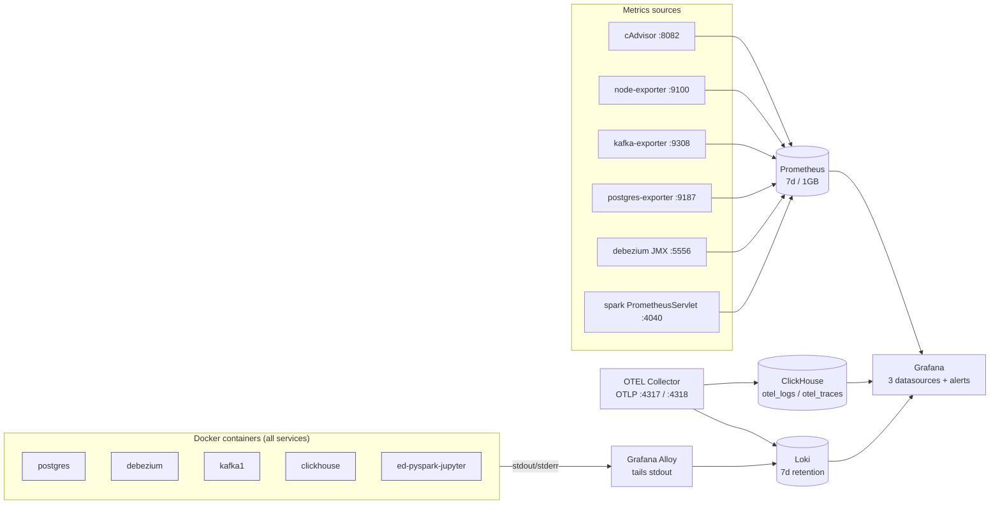

# Observability

Local-dev observability stack layered onto the CDC pipeline: **logs via Loki+Alloy**, **metrics via Prometheus + exporters + cAdvisor + node-exporter**, **five infra alerts** provisioned into Grafana, and an **optional OTEL Collector** as a unified OTLP ingress.

Prerequisite reading: [`architecture.md`](architecture.md) for the pipeline this stack observes.

Compose file: `infrastructure/docker/docker-compose.observability.yml`. Included by default in `make up` (~700 MB footprint).

## Topology

## Log pipeline (Loki + Alloy)

- **Agent**: `grafana/alloy:v1.4.3` — tails every Docker container stdout/stderr.
- **Store**: `grafana/loki:2.9.10`, single-binary, filesystem storage, **168 h (7 d) retention** enforced by the Loki compactor.
- **Labels kept**: `container`, `image`, `compose_service`, `stream`.
- **Labels dropped by relabeling**: Docker-daemon `id`, container SHA (bounded cardinality across restarts).
- **Query**: Grafana Explore → Loki datasource. Example: `{container="debezium"} |= "ERROR"`.

## Metrics pipeline (Prometheus + exporters)

- **Store**: `prom/prometheus:v2.54.1` launched with `--storage.tsdb.retention.time=7d` and `--storage.tsdb.retention.size=1GB`.
- **Scrape config**: `infrastructure/docker/prometheus/prometheus.yml`, global `scrape_interval: 15s`.
- **Cardinality guardrail**: cAdvisor's `id` label dropped in scrape-side `metric_relabel_configs`.

Scrape targets:

| Phase | Job | Endpoint | Notes |
|---|---|---|---|
| 1 | `cadvisor` | `cadvisor:8080` | Per-container CPU/mem/net/disk |
| 1 | `node-exporter` | `node-exporter:9100` | Host-level metrics (`--path.rootfs=/host`) |
| 2 | `kafka-exporter` | `kafka-exporter:9308` | Broker + consumer-group lag (`danielqsj/kafka-exporter:v1.8.0`, `platform: linux/amd64`) |
| 2 | `postgres-exporter` | `postgres-exporter:9187` | Custom queries expose `pg_replication_slots` + `pg_stat_replication` for the Debezium slot |
| 2 | `debezium-jmx` | `debezium:5556` | JMX-exporter javaagent → `kafka_connect_connector_status`, `debezium_metrics_*` |
| 2 | `spark` | `ed-pyspark-jupyter:4040/metrics/prometheus` | PrometheusServlet; target `down` when no job is running is benign |

The JMX agent jar is bind-mounted from `infrastructure/docker/jmx-exporter/` (jar itself is gitignored; fetched by `scripts/setup_observability.sh`).

## Alerts

Provisioned into the `observability` Grafana folder from `infrastructure/docker/grafana/provisioning/alerting/infra-alerts.yml`:

| Rule | Condition | `for` | Severity |
|---|---|---|---|
| `kafka_consumer_lag_high` | sum-by-consumergroup lag > 10000 | 5 m | warning |
| `debezium_connector_not_running` | `kafka_connect_connector_status{status="running"} < 1` | 1 m | critical |
| `spark_streaming_job_absent` | no batch progress in 10 min | 5 m | critical |
| `container_memory_over_90pct` | cAdvisor usage / limit > 0.9 | 10 m | warning |
| `container_restart_loop` | > 3 restarts in 10 min | 2 m | critical |

Plus `cdc_freshness_10min_slo` from `data_freshness.yml` (data-governance Phase 3), routed through the shared default contact point.

**Contact points** (provisioned from `contact-points.yml`):
- `default-webhook` — URL from `OBS_ALERT_WEBHOOK_URL` env var
- `slack` — URL from `OBS_SLACK_WEBHOOK_URL` env var

If either env var is unset the URL falls back to a noop placeholder; provisioning still succeeds and alerts still surface in the Grafana UI even though external delivery is off.

## Grafana datasources

Three provisioned datasources; observability sources are locked (`editable: false`) so the UI cannot silently drift from provisioned truth:

| Datasource | Points at | `editable` |
|---|---|---|
| `ClickHouse-Analytics` | `http://clickhouse:8123` | `true` |
| `Loki` | `http://loki:3100` | `false` |
| `Prometheus` | `http://prometheus:9090` | `false` |

Files: `infrastructure/docker/grafana/provisioning/datasources/{clickhouse,loki,prometheus}.yml`. Deep-dive on the analytics side of the ClickHouse datasource: [`analytics.md`](analytics.md).

## OTEL Collector (Phase 4, optional-but-included)

`otel/opentelemetry-collector-contrib:0.109.0`, config at `infrastructure/docker/otel/collector-config.yaml`.

Pipelines:
- Accept OTLP over **gRPC :4317** and **HTTP :4318**.
- Tail Docker container logs via the `filelog` receiver (parallel to Alloy — Loki dedupes).
- Export logs to Loki **and** ClickHouse `otel_logs`.
- Export traces to ClickHouse `otel_traces` (+ `otel_traces_trace_id_ts` index + materialized view).

Applications instrumenting with the OpenTelemetry SDK point their exporter at `http://otel-collector:4318` (in-network) or `http://localhost:4318` (host-side).

Self-metrics: `http://localhost:8889/metrics` — should include `otelcol_exporter_queue_capacity` for both the `loki` and `clickhouse` exporters.

## Restart policies & healthchecks

Pattern applied stack-wide:

| Class | Policy | Applies to |
|---|---|---|
| Stateful | `restart: unless-stopped` | postgres, kafka1, zookeeper, clickhouse, grafana, prometheus, loki, schema-registry |
| Stateless | `restart: on-failure:3` | debezium, debezium-ui, redpanda-console, cdc-testing-ui, alloy, cadvisor, node-exporter, kafka-exporter, postgres-exporter |
| Dev-only | *(none)* | `ed-pyspark-jupyter` — deliberately no restart so Spark job death is visible via `spark_streaming_job_absent`, not silently masked |

Every service with a well-defined readiness probe declares a `healthcheck:`; downstream services use `depends_on: { condition: service_healthy }` so `make up` sequences without time-based sleeps. Checks include `pg_isready`, `kafka-topics --list`, Debezium Connect `curl -f localhost:8083/connectors`, ClickHouse `/ping`, Loki `/ready`, Prometheus `/-/ready`, Grafana `/api/health`, Apicurio `/apis/registry/v2/system/info`.

Full host-side port list is in [`architecture.md`](architecture.md#local-service-urls-after-make-up).

## Verify locally

- `curl -s http://localhost:9090/api/v1/targets | jq '[.data.activeTargets[] | {job, health}]'` — expect all Phase 1/2 jobs `up` (except `spark` when no CDC job is running).
- `curl -s http://localhost:3100/loki/api/v1/labels` — label set should be `{container, image, compose_service, stream}` only.
- Grafana → Alerting → the `observability` folder should list all five infra rules plus `cdc_freshness_10min_slo`.
